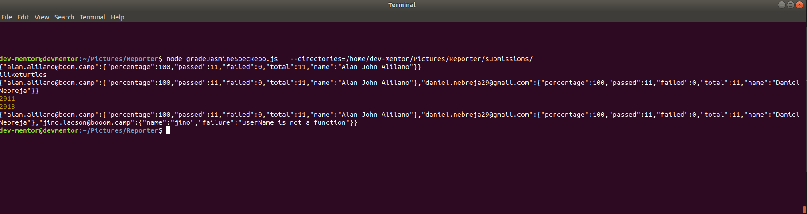

# Jasmine reporter

The goal here is to make reporting automated and results accurate 

File needed to update: `simpleJsonJasmineReporter.js`

[Documentation](https://jasmine.github.io/tutorials/custom_reporter)

### Install dependencies

```
npm install
```

### Command

Change: `/home/dev-mentor/Pictures/` with your own path 

```
node gradeJasmineSpecRepo.js   --directories=/home/dev-mentor/Pictures/Reporter/submissions/ 
```

Argument:

**--directories** = Student submissions to be check under Reporter/submissions folder


Example: 

The results below are not accurate, i made some changes to make it able to run




